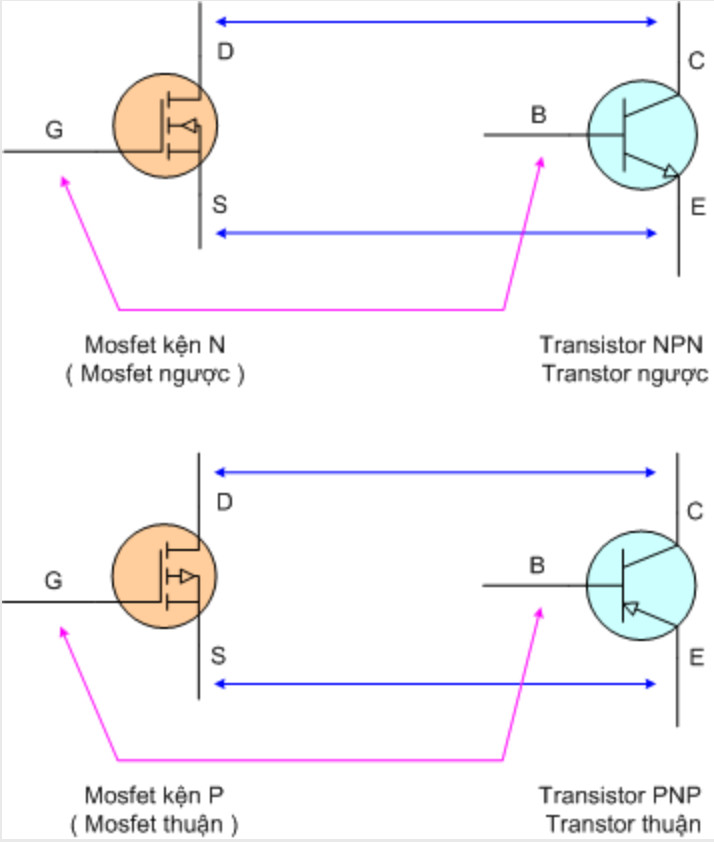

# Transistor bán dẫn
    Transistor gồm ba lớp bán dẫn ghép với nhau hình thành hai mối tiếp giáp P-N\
    Nếu ghép theo thứ tự PNP ta được Transistor thuận\
    Nếu ghép theo thứ tự NPN ta được Transistor ngược\
    Về phương diện cấu tạo Transistor tương đương với hai Diode đấu ngược chiều nhau\

# Mosfet (FET)
    Lưu ý các chân G-D-S\
    Mosfet chiều từ D qua S là mosfet thuận, từ S qua D là mosfet nghịch\
    Một số loại mofest có tên với số lẻ là thuận, số chẳn là nghịch\
